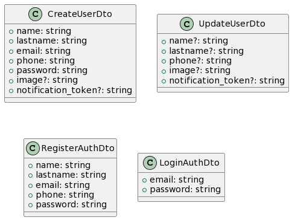
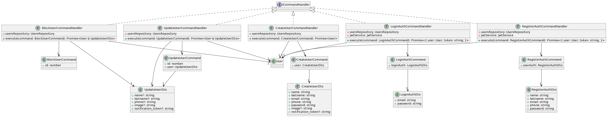
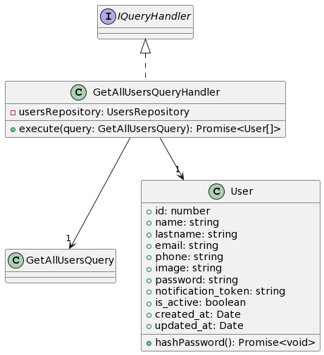
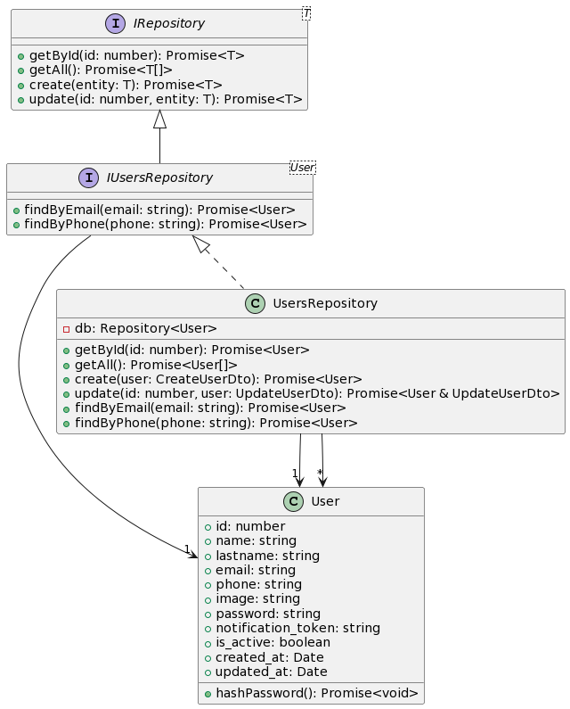
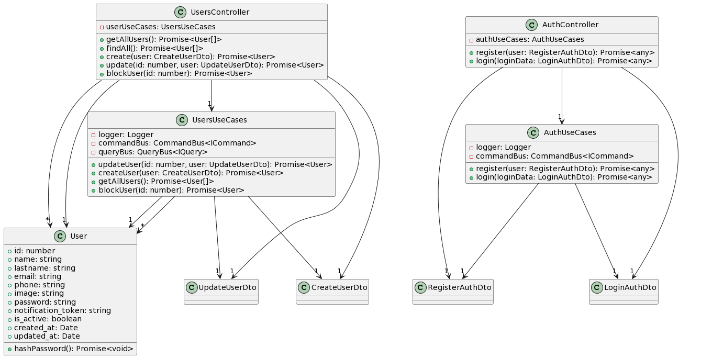

# Patrones de diseño implementados

## DTO (Data Transfer Object)

El patrón DTO (Data Transfer Object) se utiliza para transferir datos entre diferentes componentes de un sistema, especialmente cuando se necesita pasar datos entre capas o servicios. Los DTOs son objetos simples que contienen campos para almacenar datos y no tienen lógica adicional. Su propósito principal es proporcionar una estructura clara y eficiente para transportar datos sin exponer la implementación interna del sistema.

Los DTOs suelen utilizarse en aplicaciones distribuidas o en arquitecturas de microservicios, donde los datos se transmiten a través de la red. Al utilizar DTOs, se puede reducir el acoplamiento entre los componentes y mejorar la eficiencia al enviar solo los datos necesarios.

## CQRS (Command Query Responsibility Segregation)

CQRS es un patrón de arquitectura que propone separar las operaciones de escritura (comandos) y las operaciones de lectura (consultas) en sistemas complejos. El objetivo principal del CQRS es optimizar el rendimiento y la escalabilidad, permitiendo diferentes modelos y enfoques para las operaciones de escritura y lectura.

### Command

En el contexto de CQRS, el patrón Command se utiliza para representar las intenciones de realizar una acción o una operación en el sistema. Los comandos encapsulan la información necesaria para llevar a cabo una operación, como la creación, actualización o eliminación de datos.

Los comandos se envían a los correspondientes Command Handlers, que son responsables de ejecutar la lógica de negocio asociada y realizar las operaciones necesarias en el modelo de dominio. Los comandos pueden desencadenar cambios en el estado del sistema o generar eventos para notificar sobre los cambios realizados.

El patrón Command en CQRS ayuda a separar las operaciones de escritura de las operaciones de lectura, lo que permite una mayor flexibilidad y escalabilidad al tratar con diferentes requerimientos y cargas de trabajo en un sistema.

### Queries

En el contexto de CQRS (Command Query Responsibility Segregation), los queries representan las operaciones de lectura o consultas que se realizan en un sistema. Los queries permiten obtener información específica o realizar búsquedas en los datos almacenados. Estas consultas se realizan en un modelo de lectura optimizado para la consulta, separado del modelo de escritura utilizado por los comandos. Al separar las operaciones de lectura de las operaciones de escritura, se puede optimizar el rendimiento y la escalabilidad del sistema, ya que cada modelo se puede diseñar y ajustar de manera independiente para satisfacer las necesidades específicas. Los queries se envían a los Query Handlers, que son responsables de procesar las consultas y devolver los resultados correspondientes. Estos handlers pueden acceder al modelo de lectura, que puede estar construido con proyecciones o vistas materializadas de los datos subyacentes. Esto permite una recuperación eficiente de los datos y la presentación de información actualizada y coherente para satisfacer los requisitos de consulta del sistema. En resumen, los queries en el contexto de CQRS permiten separar y optimizar las operaciones de lectura para mejorar el rendimiento y la eficiencia de un sistema distribuido o de alta carga de trabajo.

## Repository (Patrón Repository)

El patrón Repository se utiliza para abstraer el acceso a los datos y proporcionar una interfaz común para interactuar con ellos. Actúa como una capa de persistencia entre la lógica de negocio y el almacenamiento de datos subyacente (por ejemplo, una base de datos).

El patrón Repository permite separar la lógica de negocio de los detalles de acceso a datos, lo que facilita el mantenimiento y la prueba de la aplicación. Además, facilita la adopción de cambios en la fuente de datos subyacente, ya que los clientes solo interactúan con la interfaz del Repositorio en lugar de depender directamente de la implementación específica del almacenamiento de datos.

## Service Layer

El patrón Service Layer, también conocido como Capa de Servicios, es un patrón de diseño que se utiliza para encapsular la lógica de negocio de una aplicación y separarla de los detalles de implementación y acceso a datos. En este enfoque, los servicios se encargan de realizar operaciones específicas y actúan como intermediarios entre los componentes de la aplicación, promoviendo una arquitectura modular, reutilizable y de fácil mantenimiento. Los servicios se centran en la ejecución de tareas relacionadas con la lógica de negocio, interactúan con otros componentes según sea necesario y permiten una clara separación de responsabilidades, lo que facilita la prueba, la escalabilidad y la evolución de la aplicación.

## Factory

## Strategy

